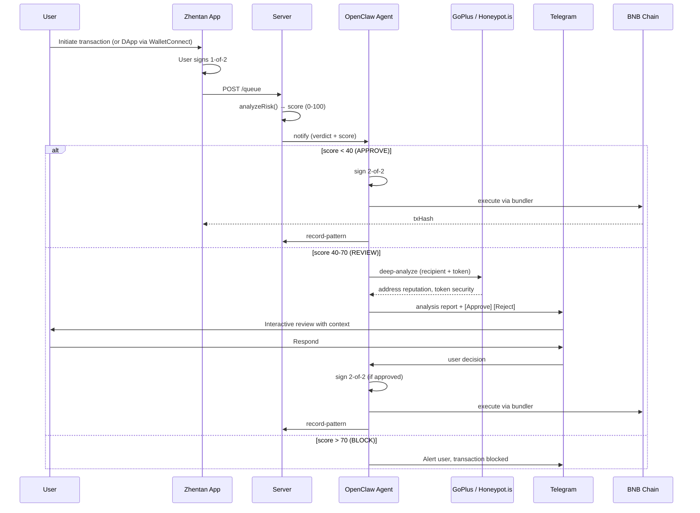

# Project: Zhentan

> Live onchain activity (smart accounts + transactions on BNB Chain): [docs/ONCHAIN.md](./ONCHAIN.md)

## 1. Problem

DeFi wallets offer no protection between "sign" and "execute." Once a user clicks approve, the transaction goes through — even if it's a scam, a fat-finger, or a social engineering attack. Users bear the full cognitive burden of verifying every transaction in real time, with no safety net.

**Who is affected:** Individual DeFi users, DAO treasuries, protocol teams, and anyone managing funds on-chain.

**Why it matters:**
- $2.2B+ lost to crypto hacks and scams in 2023 alone (Chainalysis)
- Phishing, address poisoning, and honeypot tokens are the top attack vectors
- Existing hardware wallets and browser extensions only confirm what you already signed — they don't screen it

## 2. Solution

Zhentan is a personalized wallet assistant that acts as an AI co-signer on a Safe 2-of-2 multisig. It learns your behavioral patterns and screens every transaction before it executes — blocking threats, flagging anomalies for review, and auto-approving routine activity.

**Key capabilities:**
- **Behavioral learning:** Builds a profile of your typical recipients, amounts, time-of-day activity, and token categories — updated automatically after every confirmed transaction
- **Instant risk scoring (0–100):** Every transaction is scored server-side against your learned patterns before reaching the agent
- **Three-tier response:** APPROVE (agent auto-signs 2-of-2) / REVIEW (deep analysis + Telegram interactive buttons) / BLOCK (reject + alert)
- **Deep analysis on REVIEW:** GoPlus + Honeypot.is checks run automatically for every REVIEW-tier transaction — address reputation, sanctions, honeypot detection, and token tax rates delivered to the user before they decide
- **OpenClaw Agent as 2nd signer:** The agent communicates with the user via Telegram and holds the 2nd key — no transaction executes without its signature
- **WalletConnect support:** Any DApp (PancakeSwap, Venus, etc.) routes through the same screening pipeline
- **Gasless:** Account abstraction (ERC-4337) + bundler, zero gas fees for users

**User flow:**

**Why this approach:**
- Deterministic inline scoring is instant — no LLM latency on the hot path; the agent only steps in after a verdict is reached
- The agent owns all user communication (Telegram) and the 2nd signature — making it genuinely agentic, not just advisory
- Deep analysis runs automatically for REVIEW-tier transactions, giving users real security context before they decide
- Pattern recording after every confirmed transaction means the profile improves continuously without manual input
- Safe multisig is battle-tested infrastructure; Zhentan adds AI intelligence on top without replacing key management

## 3. Business & Ecosystem Impact

**Target users:**
- Individual power users managing >$10K in DeFi
- DAO multisig signers (complement to Gnosis Safe)
- Protocol treasuries requiring audit trails
- Newcomers who want guardrails without custody trade-offs

**Adoption strategy:**
1. Self-hosted, open-source agent (OpenClaw skills pack)
2. Hosted service with per-user screening profiles
3. SDK for other wallets to embed the risk scoring layer

**Ecosystem benefits:**
- Reduces onchain fraud volume on BNB Chain
- Demonstrates production-ready AI agent use for onchain security
- Builds the case for AI co-signers as a standard primitive in account abstraction wallets

**Revenue model (post-hackathon):**
- Free: basic screening, advanced deep analysis + public open claw agent, TG channel
- Advanced: All featured of Free + Newer AI model + Personal instance for each user (Coming soon)
- Self hosted agent: Instruction coming soon.

## 4. Limitations & Future Work

**Current limitations:**

- Deep analysis (GoPlus/Honeypot.is) is on-demand only with agentic communication. Can be exteded with other services
- Live demo at zhentan.me runs with public OpenClaw agent — personalised AI screening requires local setup

**Near-term roadmap:**
- [ ] Advance plan: All featured of Free + Newer AI model + Personal instance for each user 
- [ ] Multiple channel support for communication with agent
- [ ] More multisig configuration with multiple agents for screening

**Long-term:**

- [ ] Community-sourced threat intelligence feed
- [ ] SDK to support integration with existing multisig
