# Technical Documentation

> One place for **how** the system works and how to run and use it.
> Live onchain activity: [docs/ONCHAIN.md](./ONCHAIN.md)

## Architecture

### System Overview

Zhentan is composed of three independently runnable components:

| Component | Role |
|-----------|------|
| `client/` | Next.js 14 frontend — onboarding, dashboard, send/receive, WalletConnect, invoices |
| `server/` | Express API — inline risk analysis, Zerion portfolio |
| `zhentan-skills/` | OpenClaw skill pack — conversational agent layer: responds to owner commands, runs deep analysis, signs approved txs, records patterns, handles invoices |


### Component Breakdown

**Client (`client/`)**
- Next.js 14 App Router, React 18, TypeScript
- Privy for Google OAuth + embedded wallet creation
- Deploys a Safe 2-of-2 smart account per user (owner = user's embedded wallet, co-signer = agent address)
- Signs 1-of-2 for every transaction, then POSTs to `/queue`
- WalletConnect v2 integration: acts as a wallet for DApps
- Portfolio via Zerion API (live balances, prices, 24h change)

**Server (`server/`)**
- Express with TypeScript (tsx for dev, PM2 for production)
- `/queue` — receives txs, runs `analyzeRisk()`, auto-executes or triggers Telegram review
- `/execute` — agent-called endpoint to co-sign + submit UserOperation to Pimlico
- `/transactions` — returns pending queue
- `/invoices` — invoice queue management
- File-based JSON storage to share with agent: `pending-queue.json`, `invoice-queue.json`, `state.json`, `patterns.json`

**Zhentan Skills (`zhentan-skills/`)**
- OpenClaw skill pack. The agent's role is **conversational** — the server handles the deterministic pipeline (inline risk scoring, auto-execute on APPROVE). The agent responds to owner commands via Telegram and provides analysis when asked.
- Activated by symlinking the skills directory into OpenClaw's workspace and restarting the gateway (no cron setup required).
- **Owner commands via Telegram:**
  - `approve <tx-id>` — runs `sign-and-execute`, then `record-pattern`, updates TG message with tx hash
  - `reject <tx-id>` — runs `reject-tx`, updates TG message
  - `analyze <tx-id>` / 🔎 Deep Analyze button — runs `deep-analyze` (GoPlus + Honeypot.is), reports findings
  - `get-status` — returns current screening mode and recent decisions
  - `screening on/off` — runs `toggle-screening`
- **Invoice handling:** when the owner sends an invoice file or message, the agent extracts fields (recipient, amount, token, due date, line items), assigns a risk score, and queues it via `queue-invoice` for dashboard review
- **Scripts:** `sign-and-execute.js`, `mark-review.js`, `reject-tx.js`, `record-pattern.js`, `deep-analyze.js`, `toggle-screening.js`, `queue-invoice.js`, `get-status.js`


### Risk Scoring Logic

Each transaction is scored 0–100 against learned patterns:

| Factor | Weight |
|--------|--------|
| Unknown recipient | +40 |
| Exceeds single-tx limit (default 5,000 USDC) | +30 |
| Amount > 3× average for known recipient | +25 |
| Would exceed daily volume limit (default 20,000 USDC) | +20 |
| Outside business hours (UTC 06:00–20:00) | +20 |

Score thresholds:
- **< 40** → APPROVE (auto-execute)
- **40–70** → REVIEW (Telegram interactive)
- **> 70** → BLOCK

### On-Chain Architecture

- **Smart Account:** Safe 1.4.1 multisig with ERC-4337 module
- **Threshold:** 2-of-2 (user + agent)
- **EntryPoint:** v0.7
- **Bundler/Paymaster:** Pimlico (gasless)


### Data Flow (sequence)

```mermaid
sequenceDiagram
    participant C as Client
    participant S as Server
    participant OC as OpenClaw Agent
    participant EXT as GoPlus / Honeypot.is
    participant TG as Telegram
    participant B as Bundler
    participant BC as BNB Chain

    C->>S: POST /queue {tx, userSignature 1-of-2}
    S->>S: analyzeRisk() → score
    S->>OC: notify (verdict + score)
    alt APPROVE
        OC->>OC: sign 2-of-2
        OC->>B: sendUserOperation
        B->>BC: execute
        BC-->>C: txHash
        OC->>S: record-pattern (update profile)
    else REVIEW
        OC->>EXT: deep-analyze (recipient + token)
        EXT-->>OC: address reputation, token security
        OC->>TG: analysis report + [Approve] [Reject]
        TG-->>OC: user responds (approve/reject)
        OC->>OC: sign 2-of-2 (if approved)
        OC->>B: sendUserOperation
        B->>BC: execute
        OC->>S: record-pattern (update profile)
    else BLOCK
        OC->>TG: sendMessage (blocked alert)
    end
```



---

## Setup & Run

### Prerequisites

| Tool | Version |
|------|---------|
| Node.js | 18+ |
| npm | 9+ |
| OpenClaw CLI | latest |

Accounts needed:
- [Privy](https://privy.io) — app ID for embedded wallets
- [Pimlico](https://pimlico.io) — API key for gasless bundler
- Telegram bot token (for Telegram review notifications)
- [Zerion](https://zerion.io) — API key for portfolio (optional)

### Environment Variables

**Client** (`client/.env.local`):
```env
NEXT_PUBLIC_PRIVY_APP_ID=your_privy_app_id
NEXT_PUBLIC_PIMLICO_API_KEY=your_pimlico_api_key
NEXT_PUBLIC_AGENT_ADDRESS=0xYourAgentAddress
NEXT_PUBLIC_BACKEND_URL=http://localhost:3001 
```

**Server** (`server/.env`):
```env
AGENT_PRIVATE_KEY=0xYourAgentPrivateKey
PIMLICO_API_KEY=your_pimlico_api_key
TELEGRAM_BOT_TOKEN=your_telegram_bot_token
ZERION_API_KEY=your_zerion_api_key           # optional
PORT=3001
QUEUE_PATH=./pending-queue.json
INVOICE_QUEUE_PATH=./invoice-queue.json
```

See `scripts/.env.example` and `server/.env.example` for full templates.

### Installation

```bash
# Client
cd client && npm install

# Server
cd server && npm install

# Skills
cd zhentan-skills && npm install
```

### Running Locally

```bash
# Terminal 1 — Server (must start first)
cd server && npm run dev
# → http://localhost:3001

# Terminal 2 — Client
cd client && npm run dev
# → http://localhost:3000
```

### Running the OpenClaw Agent

```bash
# 1. Symlink the skills into OpenClaw's workspace
mkdir -p ~/.openclaw/workspace/skills
ln -sf "$(pwd)/zhentan-skills" ~/.openclaw/workspace/skills/zhentan

# 2. Restart the OpenClaw gateway
openclaw gateway restart

# 3. Verify the skill is detected
openclaw skills check
```

### Verify It Works

1. Visit `http://localhost:3000`
2. Sign in with Google → embedded wallet is created
3. A Safe smart account is deployed (or loaded) on BNB Chain
4. Navigate to **Send** → enter a recipient and amount
5. Confirm → transaction is queued
6. Check server logs — you should see the risk score and verdict
7. If APPROVE: tx executes automatically and txHash appears in the UI
8. If REVIEW: check Telegram for the interactive approve/reject message

---

## Demo Guide

### Accessing the App

- **Live:** [https://zhentan.me](https://zhentan.me) (no AI screening, gasless transfers only)
- **Local:** `http://localhost:3000` (full screening when server + agent running)


### Troubleshooting

| Issue | Fix |
|-------|-----|
| Transaction stuck in queue | Check server logs for Pimlico API errors; verify `AGENT_PRIVATE_KEY` is set |
| No Telegram notification | Verify `TELEGRAM_BOT_TOKEN`  in server `.env` |
| Safe not deploying | Confirm BNB Chain RPC is reachable; check Pimlico API key has BSC access |
| Balance not showing | Zerion API key may be missing; check `ZERION_API_KEY` in server `.env` |
